##  R Configuration
Below we display our sessionInfo().
```{r sessionInfo}
sessionInfo(package=NULL)
```


##  Our Datasets
> The first [dataset](http://home.cc.gatech.edu/ice-gt/556) 
> was created by students at Georgia Tech University. It focuses on the demographics of test-takers for the AP CS test administered by the Collegeboard in 2013. The lowest score for an AP test is a 1, while the highest score is a 5.
> The second dataset that we used to join the AP dataset contains census data related to income in the U.S in 2015.
> Download AP dataset [here](http://home.cc.gatech.edu/ice-gt/uploads/556/DetailedStateInfoAP-CS-A-2006-2013-with-PercentBlackAndHIspanicByState-fixed.xlsx).
> Download the 2015 US Census Income data [US Census population estimates, Income (American Community Survey, 2011-2015)](https://data.world/uscensusbureau/acs-2015-5-e-income)


###  AP Test Dataset Columns
Measure | Description
------------------ | ---------------------------------------------------
2013 data  | The U.S. States
# schools  | Number of school that offer AP CS tests 
Total # | Number of AP CS test takers
Yield per teacher | Number of student test takers per teacher
# passed | The number of test takers who scored 3 out of 5 or above
% passed | The percentage of passed test takers over the total number of test takers
# female | The number of female test taker
# female passed| The number of female test taker who scored 3 out of 5 or above
% female passed| The percentage of passed female test takers over the total number of female test takers
% female | The percentage of female test takers over the total number of test takers 
# Black | The number of black test taker
# Black Passed| The number of black test taker who scored 3 out of 5 or above
% Black passed| The percentage of passed black test takers over the total number of test takers 
% black in state | Percentage of black in state 
# Hispanic | The number of Hispanic test taker
# Hispanic passed | The number of Hispanic test taker who scored 3 out of 5 or above
% Hispanic passed | The percentage of passed Hispanic test takers over the total number of test takers 
% Hispanic in state | Percentage of Hispanics in state
% taking / % state * 100 | Attempt rate of Hispanic test takers 


###  Census Dataset Columns  
Measure | Description
------------------ | ---------------------------------------
State | State abbreviation
AreaName | State full name 
median_household_income | Median household income in 2015
per_capita_income | A measurement an area's average income
gini_index | A measurement of inequality. (0 stands for perfect equality)

##  Methodology
### Original Dataset
> The 2013 AP CS test dataset before the cleaning process

```{r, echo= FALSE, warning= FALSE, message= FALSE, fig.height=4, fig.width=5} 
source("../01 Data/original_data.R")
```


### ETL Logic

   > 1. As seen from the previous table, the uncleaned AP CS data is filled up with empty columns, asterisks and multiple columns that we will not use in our data visualization. We followed the following process to clean up the data:
   
       i. Build an ETL script to pull the data from data.world and proceed the cleaning process 
```{r, eval=FALSE}
### Load Required Packages
require(readxl)
# Set the working directory to access CSVs
setwd("~/s17dvfinalproject-dvproject-4-chou-zeng-zhang-zhang/01 Data")

# df <- read_excel("./01 Data/DetailedStateInfoAP-CS-A-2006-2013-with-PercentBlackAndHIspanicByState-fixed.xlsx", sheet = "Sheet2")
df <- read_excel("../01 Data/DetailedStateInfoAP-CS-A-2006-2013-with-PercentBlackAndHIspanicByState-fixed.xlsx", sheet = "Sheet2")
```
       ii. Remove empty column from dataframe.
```{r, eval=FALSE}
# Remove empty column from dataframe
df <- subset(df, select = -c(X__1))
```
       iii. Remove last 4 rows of dataframe.
```{r, eval=FALSE}
# Remove last 4 rows of dataframe
n <- dim(df)[1]
df <- df[1:(n-4), ]
```
       iv. Remove asterisks (*) from dataframe and replace them with ""
```{r, eval=FALSE}
# Remove asterisks (*) from dataframe and replace with ""
df <- lapply(df, function(x) {
  gsub("\\*", "", x)
})
```
       v. Replace any record that is "" with NA.
```{r, eval=FALSE}
# Replace any record that is "" with NA
df[df == ""] <- NA
```
       vi. Rename columns of dataframe for clarity and simplicity.
```{r, eval=FALSE}
# Rename columns of dataframe
colnames(df) <- c("state", "number_of_schools", "total_takers", "yield_per_teacher", 
                  "total_passed", "percent_passed", 
                  "total_female","total_female_passed", "percent_female_passed", "percent_female_taking", 
                  "total_black", "total_black_passed", "percent_black_passed", "percent_black_taking", "percent_black_state", "attempt_rate_black", 
                  "total_black_females", "total_black_females_passed", "percent_black_females_passed", 
                  "total_hispanic", "total_hispanic_passed", "percent_hispanic_passed", 
                  "total_hispanic_female", "total_hispanic_female_passed", "percent_hispanic_female_passed", "percent_hispanic_taking", "percent_hispanic_state", "attempt_rate_hispanic")
```
       vii. Generate a cleaned up dataset called "ap_cs_2013_states_clean.csv"
```{r, eval=FALSE}
# Write finished dataframe to csv file
write.csv(df, file = "ap_cs_2013_states_clean.csv", row.names=FALSE, na="")
```       
   >2. In order to join the AP CS 2013 dataset to the 2015 Income Census data, we ran a query on data.world in order to rename the columns for simplicity, and we downloaded it as "acs-2015-5-e-income-queried.csv".
   >3. Use Tableau's web data connector to import the datasets. Join the two datasets together by State to merge the datasets in order for us to explore the relationship between two datasets.
   >4. We had to set the "S17 DV Project 6" data.world datasets PUBLIC in order to access and work on it in RStudio when we wrote the server code.
   >5. Use SQL and R SDK in order to create the similar and other visualizations with ggplot. 
   >6. Create the Shiny App which includes all of the different types of visualizations, and publish it onto the Shiny server.

### Cleaned Dataset
> This is the AP CS Test dataset after the cleaning process:

```{r, echo= FALSE, warning= FALSE, message= FALSE, fig.height=4, fig.width=5} 
source("../01 Data/etl_final_project.R")
```


##  Visualizations
Visualizations were created using both Tableau and R Shiny. 

###  Box Plots
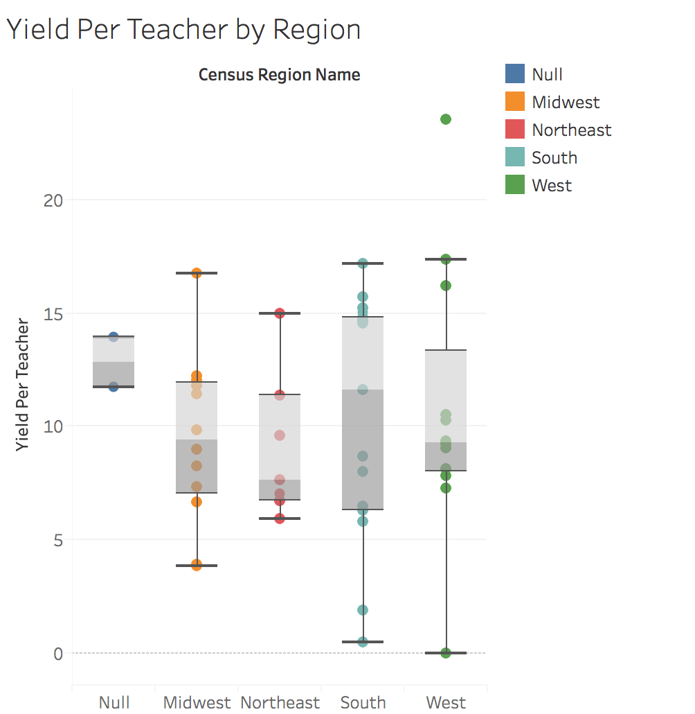

> **Insight for Figure 1: *Yield Per Teacher by Region* **  
These boxplots compare the distributions of test takers per teacher between each region. The distributions are not drastically different overall. Their spreads are rather similar, and it seems that the median ratio hovers around 10 test takers per teacher.

> It seems as though the Northeast has a lower test taker to teacher ratio than the other regions. The South certainly has the most variation in its distribution, as well as possessing the highest median test taker to teacher ratio. All but one distribution contain no outliers. The West region contains two, with each being at opposite extremes of the test taker per teacher metric.

> This boxplot displays the distribution of yield per teacher in each region.
For West region, the points are relatively concentrated however there is an outlier(California).  

### Histogram
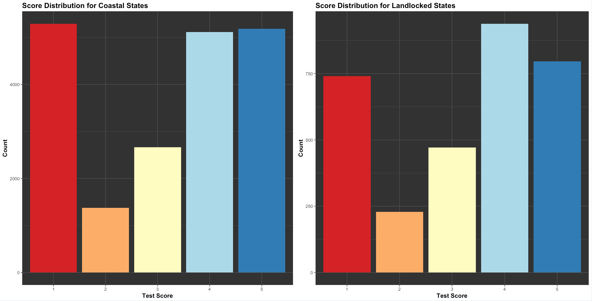

> **Insight for Figure 2: *Score Distributions for Coastal and Landlocked States* **  
We wanted to see if there was a significant difference in the distributions in the AP score counts between US states that are geographically coastal and those that are geographically landlocked. We noticed that the distributions are almost identical, suggesting that the geography of test takers has little to do with the AP score outcomes. Also, both distributions are bimodal and almost symmetric.


### Scatter Plots

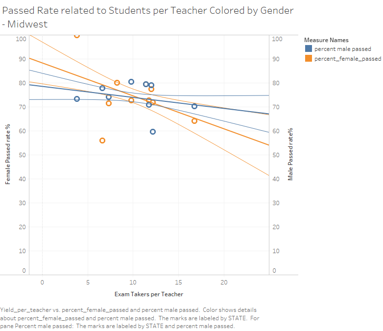

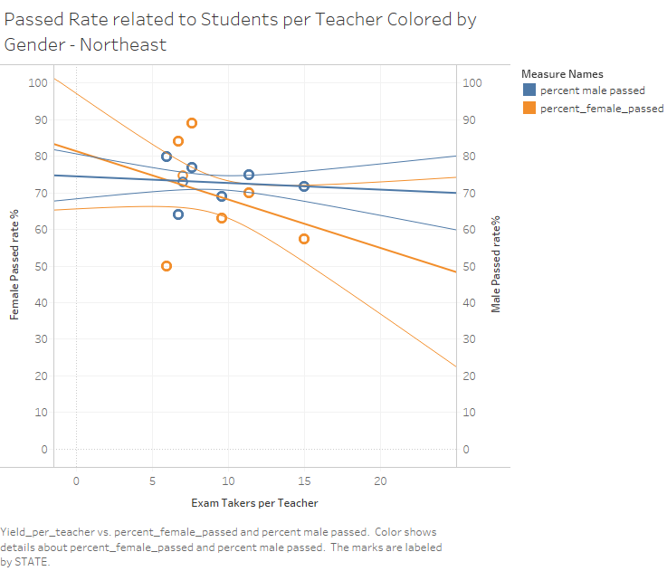
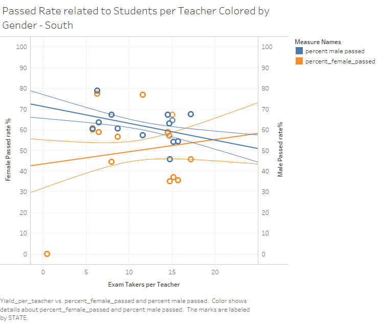
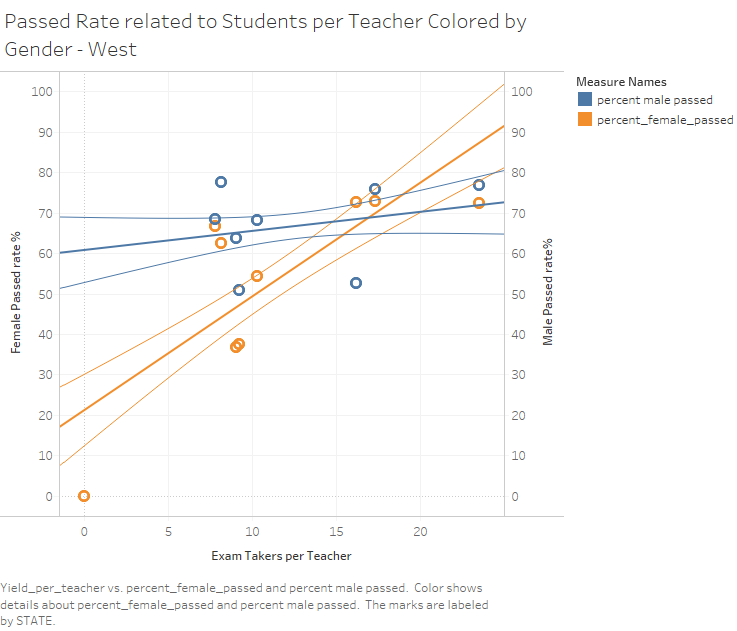

> **Insight for Figure 3 - 6: *Female Pass Rate Related to Student Teacher Ratio by Region* **  
This scatterplot demonstrates the relationship between the Exam pass rate for both Female,Male and the number of exam takers per teacher. We made scatterplot for each region, Midwest, Northeast, South and West. The line in each page is the trend line for the rate in each region. 

> In Midwest and Northeast, the pass rates tend to decrease as the number of students each teacher has increases. For South region, the female pass rate is tend to decrease however male pass rate tend to increase with number of students per teacher going up. Interestingly, in West region, with larger number of students per teacher, the pass rate for both female and male would be higher. 


### Cross Tabs
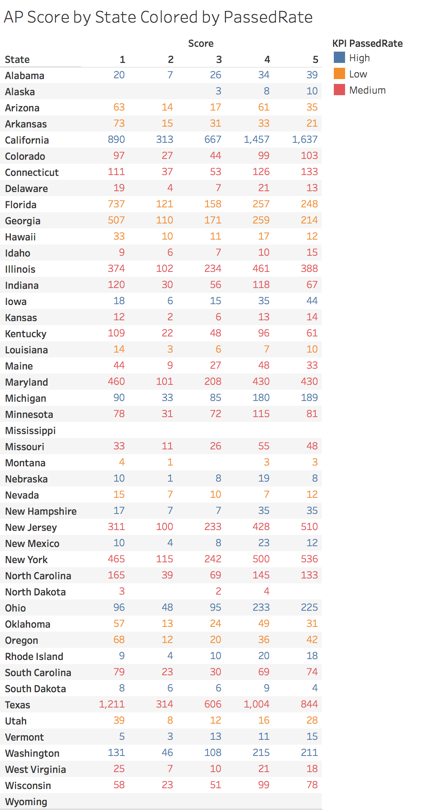

> **Insight for Figure 7: *AP Score by States Colored by Passed rate level* **  
This crosstab shows the number of people in each score category for individual states colored by KPI passed rate level. Passed rate between 0 and 60 percent is considered as low passed rate. Rate between 60 and 75 percent is set to be medium pass rate. Passed rate that is higher than 75 percent is considered high.California and Texas are the two states with largest number of AP CS exam takers and score 5 people.  

> AP Score by States Colored by Passed rate level Filtered by High per capita income states
We first select per capita income and states columns to make a bar-chart, pick 9 states with the highest per capita income  and create a high per capita income states set. 
The crosstab shows the number of people in each score category for each of the 9 states. The KPI is created using passed rate level parameter. With a relatively high per capita income, these states all have a medium to high passed rate on AP CS exam. 

### Barcharts
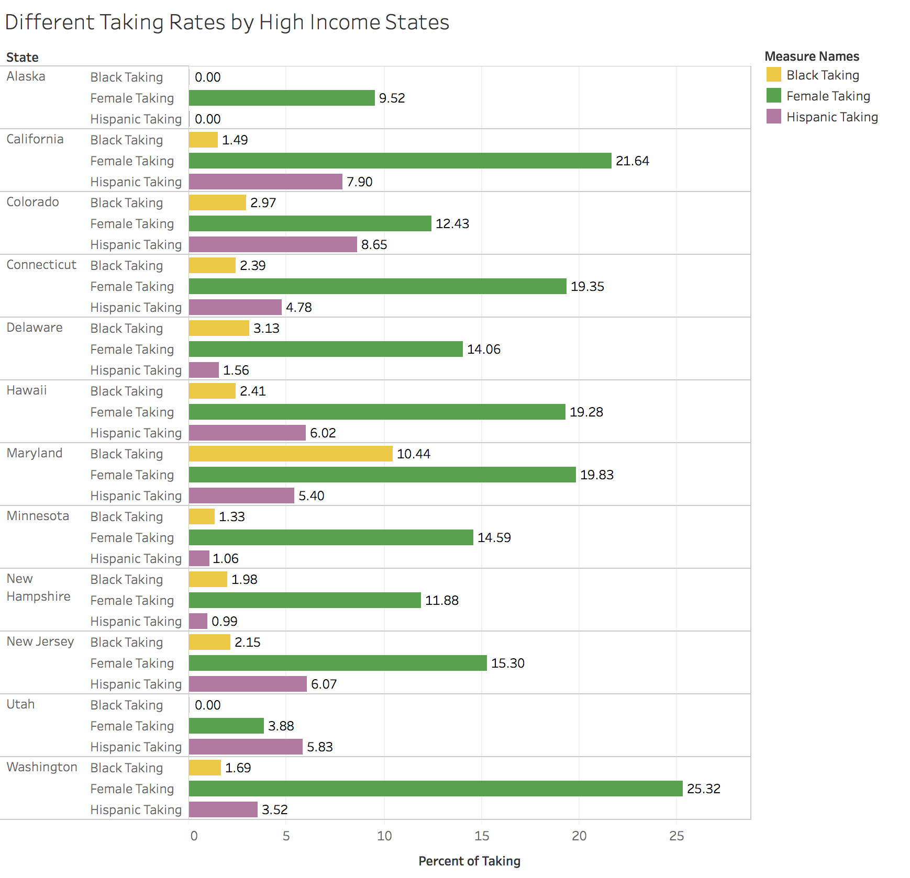

> **Insight for Figure 8: *Taking rate for Female, Black and Hispanic in high income states.* **  
First create a barcharts by selecting median household income and Area name(state) columns from the income census data. Select the 12 highest median household income states and create a high income states sets.

> This barcharts shows the taking rate for Female, Black and Hispanic in each of these 12 states. The taking rate is the number of exam takers in different category as a percentage of total takers in that state. Washington has the highest Female taking rate, 25.32 percent of total number of takers in Washington. Other high income states mostly has a Female taking rate between 10% and 20%. 

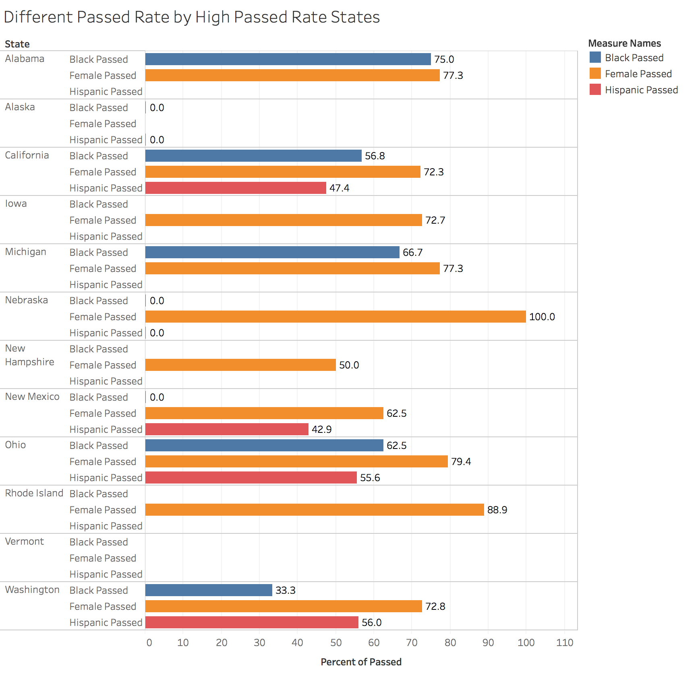

> **Insight for Figure 9: *Passed rate for Female, Black and Hispanic in high passed rate states* **  
First create a barchart by selecting percent passed and states columns from AP CS states data. Create a high passed rate states sets by picking the 12 highest percent passed states. 

> This barchart displays the different passed rate for Female, Black and Hispanic in each of these 12 states. For all the high passed rate states, Female passed rates are very high, mostly over 75 percent. Nebraska has a 100 percent Female passed rate. Alabama has a relatively high Black AP CS passed rate. However, there are some high passed rate states do not have Black or Hispanic taking the exam or do not have collected data. 

### Maps
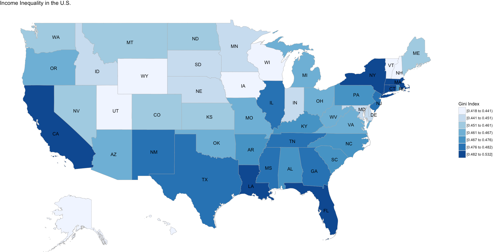

> **Insight for Figure 10: *Map of Income Inequality in the U.S.* **  
Using the census data, we created a choropleth map displaying the Gini index in the US. This map was created using Ari Lamstein's Choroplethr and Ezra Haber Glenn's ACS packages. The classes are created using the Jenks natural breaks classification method.

> The Gini index is a normalized measure of income inequality. We observed that many coastal states have generally higher index values than landlocked states, which compelled us to examine the AP CS score distributions between coastal and landlocked states, as seen in the histogram tab.

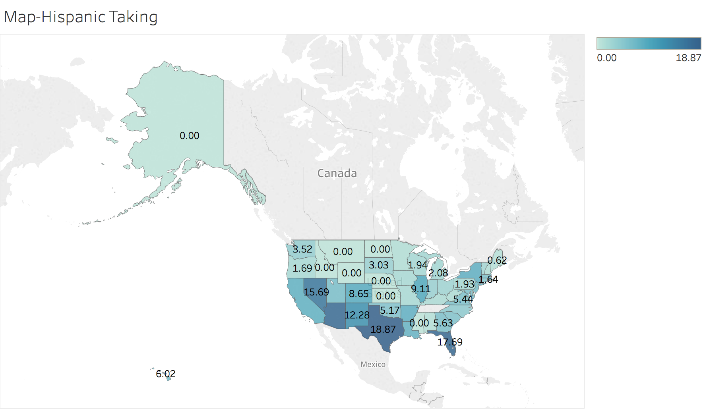

> **Insight for Figure 11: *Map of Taking Rate for Hispanic* **  
This map shows the Hispanic taking rate in each states. Percent Hispanic taking is the number of Hispanic exam takers as a percentage of total number of takers in this state. Colored and Labeled with the percent Hispanic taking. Darker Blue means a higher Hispanic taking rate, lighter color means low Hispanic taking percentage. South region has a relatively high Hispanic taking rate. 

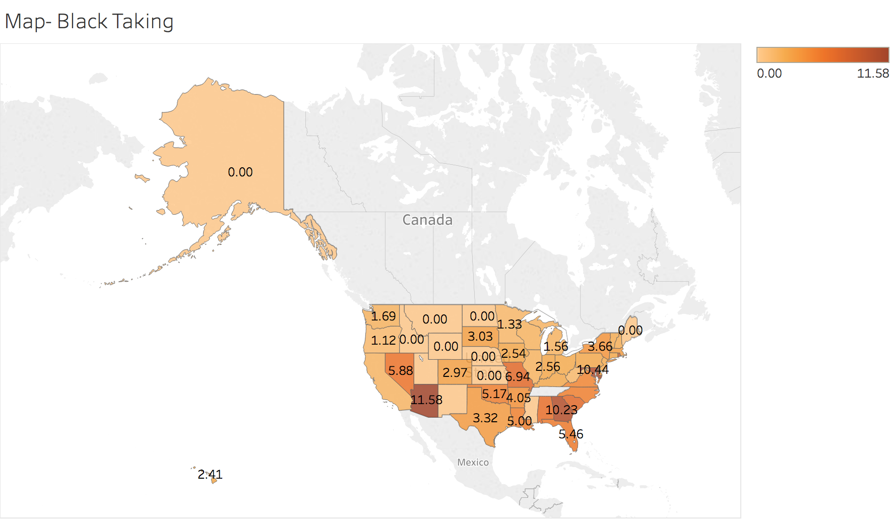

> **Insight for Figure 12: *Map of Taking Rate for Blacks* **  
This map shows the Black taking rate in each states. Percent Black taking is the number of Black exam takers as a percentage of total number of takers in this state. Colored and Labeled with the percent black taking. Darker orange means a higher Black taking rate, lighter color means low Black taking percentage. Southeast region has a relatively high Black taking rate. 

## Shiny App
To view our Shiny web app we made for the project, please click the image below. It contains other interesting visualizations that are not shown in this notebook.
[](https://andrewchou.shinyapps.io/finalproject/)


