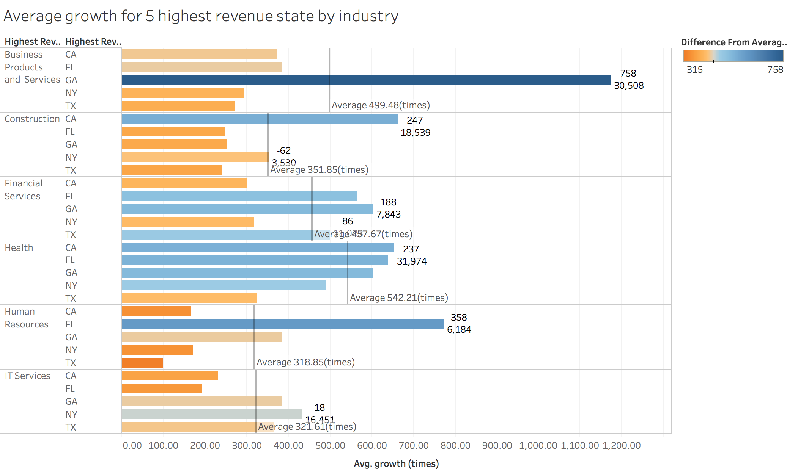
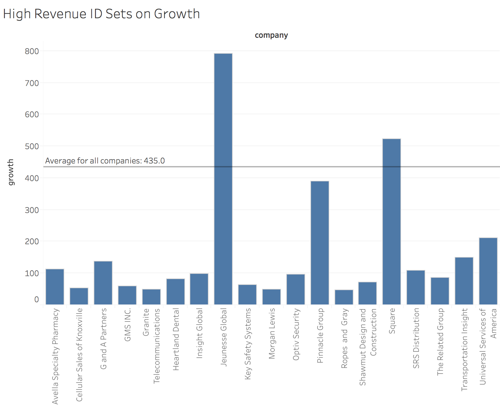
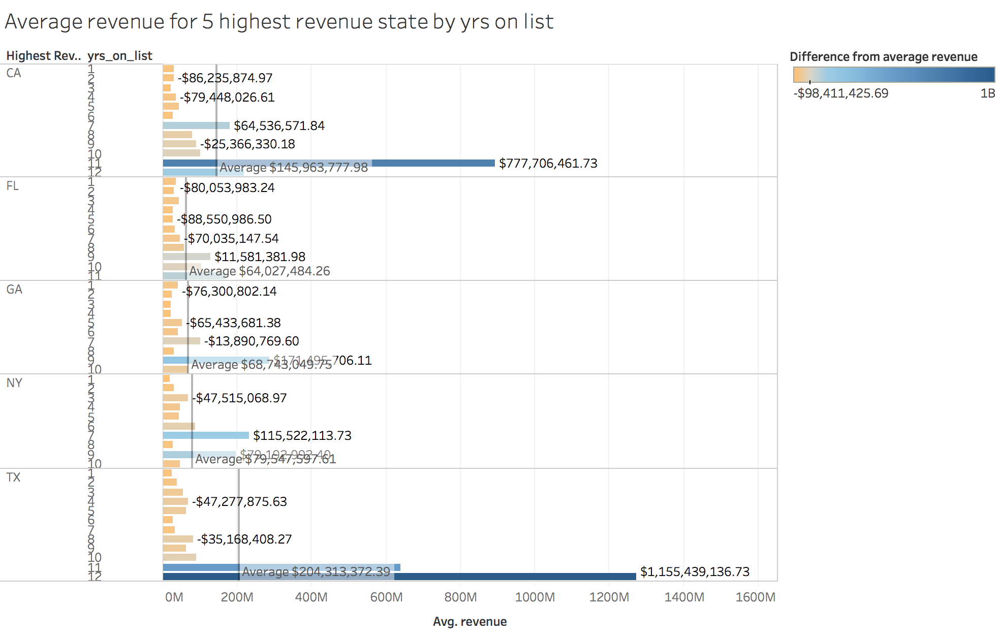

##  R Configuration
Below we display our sessionInfo().
```{r sessionInfo}
sessionInfo(package=NULL)
```

##  Our Datasets

> We used one dataset that contains the information of the top 5000 fastest growing companies in the United States:  [Inc.5000 2016: The Full List](https://www.inc.com/inc5000/list/2016/).
> Download the dataset from [here](https://data.world/albert/inc-5000-2016-the-full-list/file/inc5000_2016.csv).
> Another data that we used to join the previous one is the US Census Income data [US Census population estimates, Income (American Community Survey, 2011-2015)](https://data.world/uscensusbureau/acs-2015-5-e-income)
> Download the dataset from [here](https://data.world/uscensusbureau/acs-2015-5-e-income/file/USA_All_States.csv)
> The former includes growth rate, rank, and annual revenue of the fastest growing companies in the US. The latter primarily documents the number of households belong in different levels of income. Therefore, we joined these two datasets together by states in order to find interesting  visualizations using Barchats in tableau and implement the visualizations using the Shiny app and the ggplot. 

##  Company Dataset Content
Measure | Description
------------------ | ---------------------------------------------------
id  | Selected Companies' ID number
rank  | Companies' rank in the top5000 fastest growing companies.
workers | Number of workers in the company.
company | Company's name
url | Company's website
state_l | State's full name which the company located in 
state_s | State's name in short
city | The city in which the company is established
growth | The percentage of growth in the past three years (e.g. 66788 = 667.88%)
revenue | Revenue in 2015 (Unit: dollar)
industry | Industry Category the company belongs to
yrs_on_list | The number of years the company is on this rank list


##  Census Data Content
Measure | Description
------------------ | ---------------------------------------
State | State abbreviation
AreaName | State's full name 
number_households_participated | number of households in each state who participate in the income census survey
annual_income_less_then_50000 | number of households in the state whose annual income is less than 50000 dollar
annual_income_between_50000_and_100000 | number of households in the state whose annual income is between 50000 and 100000 dollar
annual_income_between_100000_and_150000| number of households in the state whose annual income is between 100000 and 150000 dollar
annual_income_between_150000_and_200000 | number of households in the state whose annual income is between 150000 and 200000 dollar 
                      
> This is the company dataset before the cleaning process:

```{r, echo= FALSE, warning= FALSE, message= FALSE, fig.height=4, fig.width=5} 
source("../01 Data/original_data.R")
```

##  Methodology
   > 1. Our dataset comes from [Inc. 5000 2016: The Full List](https://www.inc.com/inc5000/list/2016/) and [US Census population estimates, Income (American Community Survey, 2011-2015)](https://data.world/uscensusbureau/acs-2015-5-e-income)
   > 2. Cleaning the datasets by following steps:
 
       i. Create an ETL script to clean up the Inc. 5000 dataset.
       ii. Run a query to select and combine columns we need from the census dataset on data.world and export it. 
       iii. Upload the cleaned up company dataset and the census income dataset as csv files to data.world.
   >3. Use Tableau's web data connector to import the datasets. Join the two datasets together by State to merge the datasets for exploration. 
       
       i. Create Barcharts with one dimension and one measure at first
       ii. Create sets by selecting top 5 revenue state, top 5 revenue industry, and top fastest growth companies by their ID. 
       iii. Use sets as filters and add additional dimensions to creat interesting barcharts.
   >4. We had to set the "S17 DV Project 6" data.world datasets PUBLIC in order to access and work on it in RStudio when we wrote the server code.
   >5. Write SQL and R SDK in order to create the same Barcharts with ggplot. 
   >6. Create the Shiny App which includes all the three visualizations, and publish it onto the Shiny server.
   
   
> This is the dataset after the cleaning process:

```{r, echo= FALSE, warning= FALSE, message= FALSE, fig.height=4, fig.width=5} 
source("../01 Data/ETL_working.R")
```


##  Visualizations
Visualizations were created using both Tableau and R Shiny. 

### Shiny App
To view the Shiny web app we made for the project, click this [link](https://ronzhang.shinyapps.io/project6/).  

###  Figure 1


> **Insight for Figure 1: *Average growth rate in states for different industry* **  
This barchart displays the average growth rate in selected states for selected industry. The states selected are the top 5 states which has the highest sum revenue during 2015. The industry set used as filter includes the 6 industries which has the highest sum revenue in 2015. The horizontal bars represent the average growth rates for the specific industry in individual states. The window reference line is the average of the average growth rate for the industry in selectedstates.

> From the barchart we see that in Business product and services industry, state Georgia is growing fast, because its average growth rate is extremely higher than other states??. In Construction industry, California is playing the leading role. And in Human Resources industry, Florida shows the fastest growth. However, for Health industry, there is no obvious leading state; all states developed it well during year2015. 


### Figure 2


> **Insight for Figure 2: *High revenue ID set on Growth* **  
We create a ID Set using company id and its revenue. We select companies whose revenue greater than 10 billion as high revenue companies, and there are 19 of them. The bar chart displays the growth rate for these 19 companies. 

> Among these 19 companies with highest revenue, only two companies?? growth rate exceeds the average growth rate across the total 5000 companies.


### Figure 3


> **Insight for Figure 3: *Average revenue for 5 highest revenue state by yrs on list* **  
We first create a set of the five states with the highest revenue. For all the companies in these five states, we group them by years on the list. The bar chart shows the average revenue each group. We also calculate the difference between each bar and the average for the pane.

> In Texas, the longer companies stay on the list, the companies tend to have higher revenue. However, the extremes appear at the 9th year in Georgia and at 7th years in New York.


